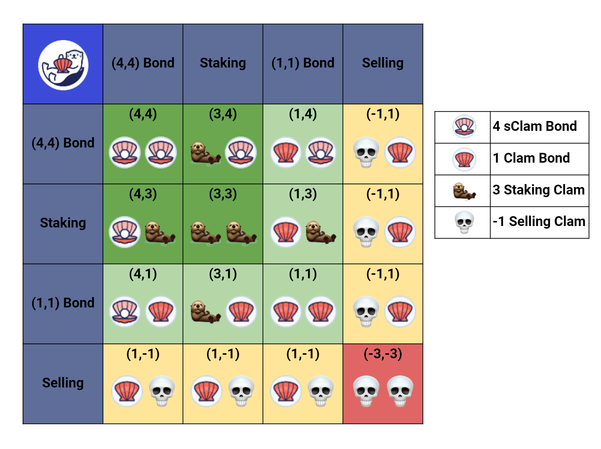

# Game Theory, (X,X)

#### Game Theory

* Players are most likely to stake when they anticipate an expansion in supply and/or price.
* Players are most likely to sell when they anticipate a contraction in supply and/or price.&#x20;
* Players are most likely to bond when they do not have a strong directional bias but don’t anticipate a significant downside.
* Game Theory is the study of mathematical models which can be used to determine the advantage or disadvantage of specific choices in a given scenario.&#x20;

#### Explanation

* 4,4 and 3,3 are some of the labels given to certain actions with regards to Game Theory.
* In the case of Clams, we use it to describe the benefits and drawbacks of the various ways in which users can interact with the Protocol.&#x20;
* Below is the OtterClams Game Theory Matrix. It is a grid that you can use to determine the benefit of users taking actions within the Protocol.&#x20;
* The columns indicate your actions while the rows indicate the actions of others. Each action is assigned a value that translates to outcome values on the table.&#x20;
*   For example:

    * if both parties stake, the outcome value is 3 + 3 = 6. This is considered a highly positive outcome for the user and the Protocol.&#x20;
    * If one user stakes whilst another buys a 4,4 bond, the outcome value is 7 (3 + 4). This is also considered a highly positive outcome.&#x20;
    * But if one user sells whilst the other stakes, this is an unfavorable outcome (-1 + 1 = 0). If both users sell, the combined downward price movement negatively affects them both.&#x20;
    * Therefore, an ideal scenario would be for all users to Stake and buy 4,4 Bonds. This allows the Protocol to build reserves and offer more attractive APYs whilst also allowing users to increase their stake and reduce their cost basis.

